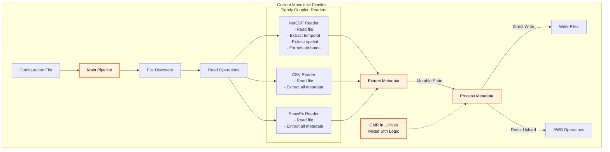
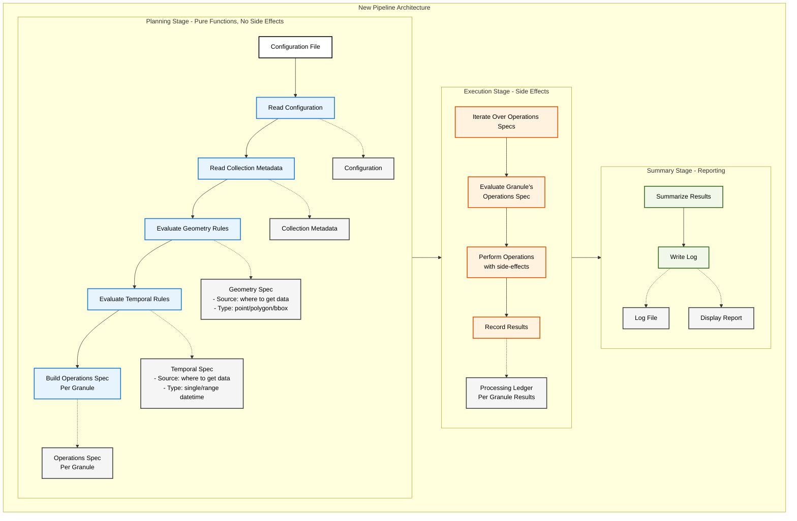

# MetGenC Pipeline Refactoring Plan

## Overview

This document outlines a plan to refactor the MetGenC pipeline to create a composable, testable, and maintainable architecture.

## Current Pipeline Issues

The current pipeline has several architectural limitations:

1. **Mixed concerns**: Decision-making and execution are intertwined throughout operations
2. **Embedded I/O**: Reading and writing occur within pipeline operations rather than at boundaries
3. **Mutable state**: The `Granule` dataclass is modified throughout the pipeline
4. **Tight coupling**: Components depend heavily on each other and configuration state
5. **Limited composability**: Pipeline stages cannot be easily rearranged or tested in isolation
6. **Side-effect entanglement**: Business logic is mixed with I/O operations
7. **Not extensible**: Users can't provide their own code or scripts to extend MetGenC

## Goals

1. **Functional Composition**: Pipeline stages compose functionally with explicit state threading
2. **Side-Effect Isolation**: All side-effects are specified as data and executed separately
3. **Immutable State**: Pipeline context and data flow through stages immutably
4. **Dynamic Pipeline Construction**: Pipeline is built dynamically based on configuration and collection metadata
5. **Comprehensive Auditing**: Processing ledger tracks all operations for debugging and monitoring
6. **Separate Rules from Execution**: Explicit rules for geometry & temporal metadata are evaluated in one place
7. **Testability**: Each stage can be tested with mock state, no I/O required
8. **Extensible**: Users can provide simple shell scripts or Python code to extent MetGenC on the fly

## Success Criteria

- [ ] Geometry extent source & type rules are evaluated before processing granules
- [ ] Temporal extent source & type rules are evaluated beffore processing granules
- [ ] All side-effects are deferred until the execution phase
- [ ] Pipeline stages are pure functions that return (result, new_state) tuples
- [ ] Pipeline can be constructed dynamically based on configuration
- [ ] Processing ledger provides complete audit trail
- [ ] Each granule's processing is independent and parallelizable
- [ ] Existing functionality is preserved
- [ ] Performance is maintained or improved
- [ ] Code coverage target >= 80%
- [ ] Users can extend MetGenC without modifying source code
- [ ] Custom readers can be configured for any file format
- [ ] Extension mechanism is documented and has examples

## Risk Mitigation

1. **Incremental Extraction**: Extract existing logic rather than rewriting
2. **Maintain Compatibility**: Existing pipeline continues to work
3. **Test Each Phase**: Ensure extracted components work identically
4. **Simplified State Pattern**: Use a pragmatic Python approach to thread state through functions
5. **Performance Monitoring**: Track pipeline performance throughout migration

## Architecture Evolution

### Current Architecture (Before)

### New Pipeline Architecture

## Implementation Strategy - Incremental Extraction and Refactoring

### Overview

This implementation strategy focuses on extracting and refactoring existing code incrementally, prioritizing architectural improvements that enable extensibility while maintaining backward compatibility.

### Phase 1: Collection Metadata Reader Extraction
**Standalone Value**: Early collection metadata access, remove caching (not needed), more testable by mocking CMR responses

1. **Extract Collection Metadata reader that calls CMR** from utilities into standalone module
2. **Place Collection Metadata read after config** but before running any part of the pipeline
3. **Create Collection Metadata dataclass** to hold collection metadata attributes
4. **Mock CMR responses** for testing

**Benefit if stopped here**: CMR integration is isolated as an implementation detail and more testable; collection metadata read once & available for all decisions

### Phase 2a Geometry Specification Extraction
**Standalone Value**: Clean separation of geometry decision-making from execution

1. **Extract geometry decision logic** from current pipeline
2. **Define `GeometrySpec` dataclass** to capture decisions:
   - Source: where to get geometry data (granule metadata, spatial file, collection)
   - Type: what geometry type to create (point, polygon, bounding box)
   - Representation: coordinate system (geodetic, cartesian)
3. **Create `determine_geometry_spec()` function** that:
   - Takes configuration, collection metadata, and available files
   - Returns a complete specification of geometry decisions
   - Contains all business rules for geometry selection
4. **Document decision rules** clearly:
   - Priority order for data sources
   - Fallback logic
   - Override conditions
5. **Add `GeometrySpec` to pipeline context** for use in later phases

**Benefit if stopped here**: Geometry decision logic is isolated from execution, making it testable and comprehensible

### Phase 2b: Temporal Specification Extraction
**Standalone Value**: Clean separation of temporal decision-making from execution

1. **Extract temporal decision logic** from current pipeline
2. **Define `TemporalSpec` dataclass** to capture decisions:
   - Source: where to get temporal data (granule metadata, premet file, collection)
   - Type: what temporal type to create (single datetime, range datetime)
3. **Create `determine_temporal_spec()` function** that:
   - Takes configuration, collection metadata, and available files
   - Returns a complete specification of temporal decisions
   - Encapsulates all business rules for temporal selection
4. **Document decision rules** clearly:
   - When to use single vs range datetime
   - Collection temporal override logic
   - Validation requirements
5. **Add `TemporalSpec` to pipeline context** for use in later phases

**Benefit if stopped here**: Temporal decision logic is isolated from execution, testable independently

### Phase 3: Pipeline Creation
**Standalone Value**: Organized pipeline with clear data flow

1. **Create `Pipeline`** class containing:
   - Configuration
   - Collection metadata (from Phase 1)
   - Geometry specification (from Phase 2a)
   - Temporal specification (from Phase 2b)
   - Reader registry
   - Processing ledger
2. **Create new `Pipeline` class** that uses state
3. **Update pipeline operations** to use specifications:
   - Operations read the specs to know what to do
   - Specs tell WHERE to get data and WHAT type to create
   - Operations handle the HOW of extraction and formatting
4. **Ensure all actions are pure functions** that return new state

**Benefit if stopped here**: Clear separation between decision-making (specs) and execution (operations)

### Phase 4: Reader Interface Definition
**Standalone Value**: Standardized interface for all metadata extraction

1. **Define new granular reader interfaces**:
   - `TemporalReader`: Extracts temporal metadata
   - `SpatialReader`: Extracts spatial metadata
   - `AttributeReader`: Extracts general metadata/attributes
2. **Create `ReaderRegistry`** to manage reader selection
3. **Define reader selection logic** based on file types
4. **Update pipeline state** to include reader registry

**Benefit if stopped here**: Clear contract for all readers, foundation for extensibility

### Phase 5: Existing Reader Adaptation
**Standalone Value**: All readers use consistent interface

1. **Refactor `NetCDFReader`** to implement new interfaces:
   - Split into temporal, spatial, and attribute readers
2. **Refactor `Generic`** reader to implement new interfaces
2. **Refactor `CSVReader`** similarly (***Maybe***)
3. **Refactor `SnowExReader`** similarly (***Maybe***)
4. **Update reader registry** with refactored readers
5. **Remove old reader code**

**Benefit if stopped here**: Consistent reader architecture throughout the system

### Phase 6: Specify/Execute Separation
**Standalone Value**: Pure pipeline logic with deferred execution

1. **Define side effect specifications**:
   - `CreateUMMG`, `CreateCNM`, `WriteFile`, `S3Upload`, `SendMessage`
2. **Modify pipeline to return specifications** instead of executing
3. **Create planning pipeline** process granules to collect all specifications
4. **Create execution pipeline** iterate over specifications to execute with side-effects
5. **Update ledger** during execution phase

**Benefit if stopped here**: Complete separation of pure logic from side effects

### Phase 7: Custom Reader Implementation
**Standalone Value**: Support for any file format without code changes

1. **Implement custom reader base classes**:
   - `CustomTemporalReader`
   - `CustomSpatialReader`
   - `CustomAttributeReader`
2. **Add configuration parsing** for custom readers
3. **Implement subprocess execution** with JSON output parsing
4. **Add timeout and error handling**
5. **Create example custom readers** and documentation
6. **Register custom readers** in the reader registry

**Benefit if stopped here**: Users can extend MetGenC to support any file format

## Custom Reader Extension System Notes

The custom reader feature enables several important scenarios:

1. **Legacy Formats**: Support proprietary or legacy file formats without modifying MetGenC
2. **Rapid Prototyping**: Test new file formats before building native support
3. **Mission-Specific Formats**: Handle specialized formats for specific missions
4. **External Tools**: Leverage existing command-line tools (e.g., GDAL, NCO utilities)
5. **Language Flexibility**: Write readers in Python or shell scripts
