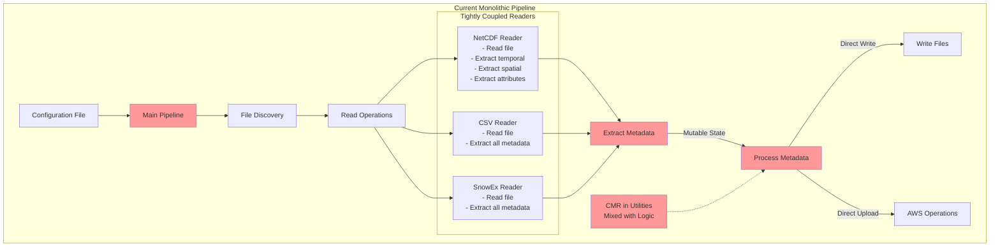

# MetGenC Pipeline Refactoring Plan

## Overview

This document outlines a plan to refactor the MetGenC pipeline using a State Monad-inspired pattern to create a composable, testable, and maintainable architecture that separates side-effects from pure computation.

The current MetGenC pipeline is not extensible by users who need to process unsupported file formats or extract metadata in ways not built into the tool. A key goal of this refactoring is to provide a built-in and natural way for users to extend MetGenC by plugging in their own code to read metadata and/or data when the tool doesn't support something out-of-the-box.

**Note**: For detailed code examples and technical implementations, see [PIPELINE_REFACTORING_CODE_EXAMPLES.md](./PIPELINE_REFACTORING_CODE_EXAMPLES.md).

## Current Pipeline Issues

The current pipeline has several architectural limitations:

1. **Mixed concerns**: Decision-making and execution are intertwined throughout operations
2. **Embedded I/O**: Reading and writing occur within pipeline operations rather than at boundaries
3. **Mutable state**: The `Granule` dataclass is modified throughout the pipeline
4. **Tight coupling**: Components depend heavily on each other and configuration state
5. **Limited composability**: Pipeline stages cannot be easily rearranged or tested in isolation
6. **Side-effect entanglement**: Business logic is mixed with I/O operations

## Key Benefit Goals

1. **Functional Composition**: Pipeline stages compose functionally with explicit state threading
2. **Side-Effect Isolation**: All side-effects are specified as data and executed separately
3. **Immutable State**: Pipeline context and data flow through stages immutably
4. **Dynamic Pipeline Construction**: Pipeline is built dynamically based on configuration and CMR metadata
5. **Comprehensive Auditing**: Processing ledger tracks all operations for debugging and monitoring
6. **Strategy Pattern**: Explicit strategies for geometry and temporal processing
7. **Testability**: Each stage can be tested with mock state, no I/O required

## Success Criteria

- [ ] Users can extend MetGenC without modifying source code
- [ ] Custom readers can be configured for any file format
- [ ] Extension mechanism is documented and has examples
- [ ] Pipeline stages are pure functions that return (result, new_state) tuples
- [ ] All side-effects are deferred until the execution phase
- [ ] Pipeline can be constructed dynamically based on configuration
- [ ] Processing ledger provides complete audit trail
- [ ] Each granule's processing is independent and parallelizable
- [ ] Existing functionality is preserved
- [ ] Performance is maintained or improved
- [ ] Code coverage remains above 90%

## Risk Mitigation

1. **Simplified State Pattern**: Use a pragmatic Python approach rather than full State Monad
2. **Feature Flags**: Toggle between old/new implementations via CLI or config
3. **Gradual Migration**: Implement one pipeline stage at a time
4. **Comprehensive Testing**: Test each stage in isolation and integration
5. **Performance Monitoring**: Track pipeline performance throughout migration

## Architecture Evolution

### Current Architecture (Before)



## New Pipeline Architecture

### Conceptual Flow

```
1. Configuration Phase
   ├─ Read configuration (Configuration Reader)
   ├─ Invoke CMR reader for collection metadata

2. Pipeline Construction Phase
   ├─ Choose geometry strategy
   ├─ Choose temporal strategy
   ├─ Select appropriate readers for file types
   └─ Build granule processing pipeline

3. Granule Processing Phase (per granule)
   ├─ Read granule files (science, premet, spatial)
   ├─ Collect metadata using strategies
   ├─ Specify operations (w/ side-effects; don't execute)
   └─ Update processing ledger

4. Side-Effect Execution Phase
   ├─ Analyze all collected specifications
   ├─ Determine efficient execution strategy
   ├─ Execute side-effects (can optimize across granules)
   └─ Record results in ledger

5. Reporting Phase
   └─ Generate summary from ledger
```

### Custom Reader Extension System

MetGenC will support custom readers for unsupported file types through configuration:
- Define custom readers using the same granular pattern as built-in readers
- Specify separate readers for temporal, spatial, and attribute metadata
- Use any external command or script that outputs JSON
- Support for piping and shell commands
- Default timeout of 120 seconds for all custom readers

### Key Architectural Components

1. **Granular Reader Architecture**: Separate interfaces for temporal, spatial, and attribute readers
2. **Pipeline State Architecture**: Immutable state threaded through pipeline stages
3. **Pipeline Stages**: Pure functions that transform data and return new state
4. **Pipeline Composition**: Orchestration of stages into a complete pipeline
5. **Side-Effect Execution**: Deferred execution with optimization strategies

## Implementation Strategy - Incremental Extraction and Refactoring

### Overview

This implementation strategy focuses on extracting and refactoring existing code incrementally, prioritizing architectural improvements that enable extensibility while maintaining backward compatibility.

### Phase 1: CMR Reader Extraction
**Standalone Value**: Testable CMR integration, early collection metadata access

1. **Extract CMR reader** from utilities into standalone module
2. **Place CMR read after config** but before running any part of the pipeline
3. **Create CMR metadata dataclass** to hold collection information
4. **Add CMR caching** to avoid repeated API calls
5. **Create mock CMR reader** for testing

**Benefit if stopped here**: CMR logic is isolated and testable, collection metadata available for all decisions

### Phase 2: Geometry Specification Extraction
**Standalone Value**: Clean separation of geometry decision-making from execution

1. **Extract geometry decision logic** from current pipeline
2. **Define `GeometrySpec` dataclass** to capture decisions:
   - Source: where to get geometry data (granule metadata, spatial file, collection)
   - Type: what geometry type to create (point, polygon, bounding box)
   - Representation: coordinate system (geodetic, cartesian)
3. **Create `determine_geometry_spec()` function** that:
   - Takes configuration, collection metadata, and available files
   - Returns a complete specification of geometry decisions
   - Contains all business rules for geometry selection
4. **Document decision rules** clearly:
   - Priority order for data sources
   - Fallback logic
   - Override conditions
5. **Add `GeometrySpec` to pipeline context** for use in later phases

**Benefit if stopped here**: Geometry decision logic is isolated from execution, making it testable and comprehensible

### Phase 3: Temporal Specification Extraction
**Standalone Value**: Clean separation of temporal decision-making from execution

1. **Extract temporal decision logic** from current pipeline
2. **Define `TemporalSpec` dataclass** to capture decisions:
   - Source: where to get temporal data (granule metadata, premet file, collection)
   - Type: what temporal type to create (single datetime, range datetime)
   - Additional configuration specific to the temporal type
3. **Create `determine_temporal_spec()` function** that:
   - Takes configuration, collection metadata, and available files
   - Returns a complete specification of temporal decisions
   - Encapsulates all business rules for temporal selection
4. **Document decision rules** clearly:
   - When to use single vs range datetime
   - Collection temporal override logic
   - Validation requirements
5. **Add `TemporalSpec` to pipeline context** for use in later phases

**Benefit if stopped here**: Temporal decision logic is isolated from execution, testable independently

### Phase 4: Pipeline State Creation
**Standalone Value**: Organized pipeline with clear data flow

1. **Create `PipelineState`** class containing:
   - Configuration
   - CMR metadata (from Phase 1)
   - Geometry specification (from Phase 2)
   - Temporal specification (from Phase 3)
   - Reader registry (empty for now)
   - Processing ledger
2. **Create new `Pipeline` class** that uses state
3. **Update pipeline operations** to use specifications:
   - Operations read the specs to know what to do
   - Specs tell WHERE to get data and WHAT type to create
   - Operations handle the HOW of extraction and formatting
4. **Ensure all actions are pure functions** that return new state

**Benefit if stopped here**: Clear separation between decision-making (specs) and execution (operations)

### Phase 5: Reader Interface Definition
**Standalone Value**: Standardized interface for all metadata extraction

1. **Define new granular reader interfaces**:
   - `TemporalReader`: Extracts temporal metadata
   - `SpatialReader`: Extracts spatial metadata
   - `AttributeReader`: Extracts general metadata/attributes
2. **Create `ReaderRegistry`** to manage reader selection
3. **Define reader selection logic** based on file types
4. **Update pipeline state** to include reader registry

**Benefit if stopped here**: Clear contract for all readers, foundation for extensibility

### Phase 6: Custom Reader Implementation
**Standalone Value**: Support for any file format without code changes

1. **Implement custom reader base classes**:
   - `CustomTemporalReader`
   - `CustomSpatialReader`
   - `CustomAttributeReader`
2. **Add configuration parsing** for custom readers
3. **Implement subprocess execution** with JSON output parsing
4. **Add timeout and error handling**
5. **Create example custom readers** and documentation
6. **Register custom readers** in the reader registry

**Benefit if stopped here**: Users can extend MetGenC to support any file format

### Phase 7: Existing Reader Adaptation
**Standalone Value**: All readers use consistent interface

1. **Refactor `NetCDFReader`** to implement new interfaces:
   - Split into temporal, spatial, and attribute readers
2. **Refactor `CSVReader`** similarly
3. **Refactor `SnowExReader`** similarly
4. **Update reader registry** with refactored readers
5. **Remove old reader code**

**Benefit if stopped here**: Consistent reader architecture throughout the system

### Phase 8: Specify/Execute Separation
**Standalone Value**: Pure pipeline logic with deferred execution

1. **Define side effect specifications**:
   - `CreateUMMG`, `CreateCNM`, `WriteFile`, `S3Upload`, `SendMessage`
2. **Modify pipeline to return specifications** instead of executing
3. **Create first mapping phase** over granules to collect all specifications
4. **Create second mapping phase** over specifications to execute with side-effects
5. **Update ledger** during execution phase
6. **Implement execution strategies** (parallel, batch, sequential)

**Benefit if stopped here**: Complete separation of pure logic from side effects

### Final Architecture (After Phase 8)

```mermaid
graph TD
    subgraph "Pure Functional Pipeline"
        Config[Configuration File] --> Pipeline[Pipeline Orchestrator]

        subgraph "Initialization Phase"
            Pipeline --> CMR[CMR Reader]
            CMR --> |Collection Metadata| Decision[Decision Phase]

            Decision --> |Creates| Specs[Specifications<br/>- Geometry Spec<br/>- Temporal Spec]

            Specs --> Context[Pipeline Context]
            Context --> |Contains| Registry[Reader Registry<br/>- Built-in Readers<br/>- Custom Readers]
        end

        subgraph "Specification Phase - Pure, No I/O"
            Context --> Discovery[Granule Discovery]

            Discovery --> |For Each Granule| GranulePipeline[Granule Pipeline]

            GranulePipeline --> FileRead[File Reading<br/>Using Registry]
            FileRead --> |Temporal| TempReaders[Temporal Readers]
            FileRead --> |Spatial| SpatReaders[Spatial Readers]
            FileRead --> |Attributes| AttrReaders[Attribute Readers]

            TempReaders --> Extract[Metadata Extraction]
            SpatReaders --> Extract
            AttrReaders --> Extract

            Extract --> Process[Process Metadata<br/>Using Specifications]
            Process --> Specify[Specify Side Effects]

            Specify --> |Returns| Specs[Effect Specifications<br/>- CreateUMMG<br/>- CreateCNM<br/>- WriteFile<br/>- S3Upload<br/>- SendMessage]
        end

        Specs --> |Collect All| AllSpecs[All Effect<br/>Specifications]

        subgraph "Execution Phase - All Side Effects"
            AllSpecs --> Executor[Side Effect Executor]

            Executor --> Analysis[Analyze Effects]
            Analysis --> |Choose Strategy| ExecStrategy{Execution<br/>Strategy}

            ExecStrategy --> |Sequential| Sequential[Sequential<br/>Execution]
            ExecStrategy --> |Parallel| Parallel[Parallel by Type]
            ExecStrategy --> |Batch| Batch[Batch Operations]

            Sequential --> Execute[Execute Effects]
            Parallel --> Execute
            Batch --> Execute

            Execute --> |Updates| Ledger[Processing Ledger]
        end

        Ledger --> Report[Generate Report]
    end

    %%% Colorblind-friendly palette with high contrast
    %%% Using patterns and distinct shades instead of relying on color alone

    %% Pure functions - Light blue with dark text
    style Pipeline fill:#E8F4FD,stroke:#1976D2,stroke-width:2px,color:#000
    style GranulePipeline fill:#E8F4FD,stroke:#1976D2,stroke-width:2px,color:#000
    style Extract fill:#E8F4FD,stroke:#1976D2,stroke-width:2px,color:#000
    style Process fill:#E8F4FD,stroke:#1976D2,stroke-width:2px,color:#000
    style Specify fill:#E8F4FD,stroke:#1976D2,stroke-width:2px,color:#000

    %% Context/State - Light gray with dark text
    style Context fill:#F5F5F5,stroke:#424242,stroke-width:2px,color:#000
    style Specs fill:#F5F5F5,stroke:#424242,stroke-width:2px,color:#000
    style AllSpecs fill:#F5F5F5,stroke:#424242,stroke-width:2px,color:#000
    style Ledger fill:#F5F5F5,stroke:#424242,stroke-width:2px,color:#000

    %% Side effects - Light orange with dark text
    style Executor fill:#FFF3E0,stroke:#E65100,stroke-width:2px,color:#000
    style Execute fill:#FFF3E0,stroke:#E65100,stroke-width:2px,color:#000

    %% Readers - Very light green with dark text
    style TempReaders fill:#F1F8E9,stroke:#33691E,stroke-width:2px,color:#000
    style SpatReaders fill:#F1F8E9,stroke:#33691E,stroke-width:2px,color:#000
    style AttrReaders fill:#F1F8E9,stroke:#33691E,stroke-width:2px,color:#000

    %% Other elements - White with dark borders
    style Config fill:#FFFFFF,stroke:#000000,stroke-width:2px,color:#000
    style CMR fill:#FFFFFF,stroke:#000000,stroke-width:2px,color:#000
    style Strategies fill:#FFFFFF,stroke:#000000,stroke-width:2px,color:#000
    style Registry fill:#FFFFFF,stroke:#000000,stroke-width:2px,color:#000
    style Discovery fill:#FFFFFF,stroke:#000000,stroke-width:2px,color:#000
    style FileRead fill:#FFFFFF,stroke:#000000,stroke-width:2px,color:#000
    style Analysis fill:#FFFFFF,stroke:#000000,stroke-width:2px,color:#000
    style ExecStrategy fill:#FFFFFF,stroke:#000000,stroke-width:2px,color:#000
    style Sequential fill:#FFFFFF,stroke:#000000,stroke-width:2px,color:#000
    style Parallel fill:#FFFFFF,stroke:#000000,stroke-width:2px,color:#000
    style Batch fill:#FFFFFF,stroke:#000000,stroke-width:2px,color:#000
    style Report fill:#FFFFFF,stroke:#000000,stroke-width:2px,color:#000
```



Key architectural improvements:
- **Complete separation** between pure computation (Specification Phase) and side effects (Execution Phase)
- **Extensible reader system** allowing custom readers for any file format
- **Strategy pattern** for geometry and temporal processing based on CMR metadata
- **Immutable state** threading through all pipeline operations
- **Optimization opportunities** in the execution phase (parallel, batch, etc.)
- **Comprehensive ledger** tracking all operations and errors

### Implementation Priorities

| Priority | Implement Phases | Key Benefits |
|----------|------------------|--------------|
| Foundation | Phases 1-3 | Extracted strategies + CMR reader |
| Core Refactor | Phases 1-4 | Above + pipeline state architecture |
| Extensibility | Phases 1-6 | Above + custom reader support |
| Full Refactor | Phases 1-7 | Above + consistent reader architecture |
| Complete | All 8 phases | Above + pure functional pipeline |

### Critical Success Factors

1. **Incremental Extraction**: Extract existing logic rather than rewriting
2. **Maintain Compatibility**: Existing pipeline continues to work
3. **Test Each Phase**: Ensure extracted components work identically
4. **Feature Flags**: Toggle between old and new implementations

## Benefits of This Approach

1. **Testability**: Each stage is a pure function with no I/O
2. **Debugging**: Complete audit trail via processing ledger
3. **Flexibility**: Easy to add new strategies or side-effects
4. **Performance**: Batch operations and parallelization
5. **Maintainability**: Clear separation of concerns
6. **Error Handling**: Non-fatal errors don't stop processing
7. **Composability**: Pipeline stages can be easily rearranged
8. **Extensibility**: Custom readers allow processing any file format

## Custom Reader Use Cases

The custom reader feature enables several important scenarios:

1. **Legacy Formats**: Support proprietary or legacy file formats without modifying MetGenC
2. **Rapid Prototyping**: Test new file formats before building native support
3. **Mission-Specific Formats**: Handle specialized formats for specific missions
4. **External Tools**: Leverage existing command-line tools (e.g., GDAL, NCO utilities)
5. **Language Flexibility**: Write readers in any language (Python, R, Julia, shell scripts)


## Risk Assessment for Partial Implementation

### What Happens If We Stop Early?

**After Phase 1 (CMR Reader Extraction)**:
- ✅ CMR logic isolated and testable
- ✅ Collection metadata available for all decisions
- ✅ Better error handling for CMR failures
- ❌ Core pipeline still monolithic

**After Phase 2 (Geometry Strategy)**:
- ✅ All above benefits
- ✅ Geometry processing is modular
- ✅ Easier to add new geometry types
- ❌ Temporal processing still embedded

**After Phase 3 (Temporal Strategy)**:
- ✅ All above benefits
- ✅ All processing strategies extracted
- ✅ Clear separation of business logic
- ❌ Pipeline structure still procedural

**After Phase 4 (Pipeline State)**:
- ✅ All above benefits
- ✅ Clear pipeline architecture
- ✅ Immutable state threading
- ❌ No extensibility for new file formats

**After Phase 5 (Reader Interface)**:
- ✅ All above benefits
- ✅ Standardized reader contract
- ✅ Foundation for extensibility
- ❌ No actual custom reader support yet

**After Phase 6 (Custom Readers)**:
- ✅ All above benefits
- ✅ Users can support any file format
- ✅ Major user-visible feature
- ❌ Existing readers still use old interface

**After Phase 7 (Reader Adaptation)**:
- ✅ All above benefits
- ✅ Consistent reader architecture
- ✅ All readers are modular
- ❌ I/O still mixed with logic

**After Phase 8 (Specify/Execute Separation)**:
- ✅ All above benefits
- ✅ Pure functional pipeline
- ✅ Complete testability without I/O
- ✅ Optimization opportunities

### Implementation Recommendations

**Foundation**: Phases 1-3 - Extract core strategies and CMR reader
**Core Refactor**: Phases 1-4 - Above + clean pipeline architecture
**Extensibility**: Phases 1-6 - Above + custom reader support (major user value)
**Full Refactor**: Phases 1-7 - Above + consistent reader system
**Complete**: All 8 phases - Above + pure functional design

The key insight: **Phase 6 (Custom Readers) delivers the most user-visible value**, while earlier phases improve code quality and maintainability.

## Migration Notes

- Old pipeline remains functional during migration
- Feature flag controls which pipeline is used
- Gradual rollout possible per collection type
- No changes to CLI interface or configuration format
- Existing tests continue to pass throughout migration
