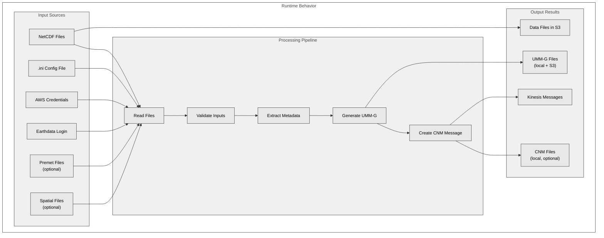
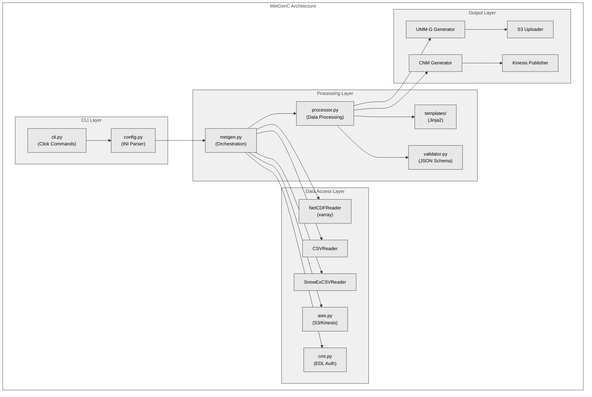

# MetGenC Architecture

## Runtime Behavior

## Code Structure and Processing Flow

### Diagram Legend

1. Runtime Behavior shows:
- Input dependencies (data files, config, credentials)
- Main processing steps
- Output artifacts and side effects
- Optional components

2. Code Structure shows:
- Layered architecture (CLI, Data Access, Processing, Output)
- Component responsibilities and relationships
- Data flow between components
- Integration points with external services
- Key classes and modules

Color coding in Code Structure diagram:
- Light Grey (#E8E8E8): Entry points/CLI layer
- Medium Light Grey (#D0D0D0): Core processing components
- Medium Grey (#B8B8B8): External service integrations
- Dark Grey (#A0A0A0): Output generators
